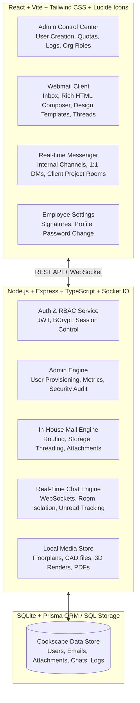

# Implementation Plan: Cookscape In-House Mail & Secure Chat Platform

Build a proprietary, full-stack corporate communication platform tailored for **Cookscape Interior Designing Company**, featuring an **Admin Management Control Panel** (account creation, quotas, roles, audit trails), a **Zoho/Gmail-style Webmail Client** (threading, rich HTML drafting, interior design proposal templates, attachments, search, tags), and a **Secure In-House Messenger & Client Project Chat Portal** with real-time Socket.IO synchronization.

---

## Architecture & Tech Stack

---

## User Review Required

> [!IMPORTANT]
> **Key Architectural Choices:**
> 1. **Zero-Config Self-Contained Database**: We will use SQLite via Prisma/TypeScript for instant local development and zero external database dependencies, while keeping it 100% modular so you can switch to PostgreSQL or MySQL anytime with a single `.env` change.
> 2. **Dual-Role Experience**: 
>    - **Admin Mode**: Manage employees (`@cookscape.com` email generation, temporary password generator, quota limits, department assignment, project assignments, security logs).
>    - **Employee / Designer Mode**: Full webmail interface (Zoho/Gmail inspired), quick Interior Design proposal/quotation templates, internal direct/channel chat, and safe client project messaging.
>    - **Client Portal Access**: Secure isolated rooms for clients (e.g. Homeowners) to review design updates and chat with their assigned designer.

---

## Proposed Changes

### 1. Root & Orchestration Configuration
Create root `package.json` with concurrently/scripts to run both backend and frontend with a single command (`npm run dev`).

---

### 2. Backend Service (`backend/`)

#### [NEW] `package.json`, `tsconfig.json`, `.env.example`
- Dependencies: `express`, `cors`, `socket.io`, `jsonwebtoken`, `bcryptjs`, `multer`, `prisma`, `@prisma/client`, `zod`, `dotenv`.

#### [NEW] `prisma/schema.prisma`
- Data models:
  - `User`: id, email (e.g. `alex@cookscape.com`), name, role (`SUPER_ADMIN`, `ADMIN`, `DESIGNER`, `EMPLOYEE`, `CLIENT`), department, avatar, quotaBytes, usedStorageBytes, isActive, passwordHash, createdAt.
  - `Email`: id, threadId, senderId, senderEmail, recipientEmails (JSON list), ccEmails, bccEmails, subject, bodyHtml, bodyText, isDraft, isStarred, isSpam, isTrash, isRead, labelIds, attachments, createdAt.
  - `Attachment`: id, emailId, filename, originalName, mimeType, size, path, createdAt.
  - `ChatRoom`: id, name, type (`CHANNEL`, `DIRECT`, `CLIENT_PROJECT`), projectId, isArchived, createdById, createdAt.
  - `ChatMember`: id, roomId, userId, role, lastReadAt.
  - `ChatMessage`: id, roomId, senderId, content, attachments (JSON), createdAt.
  - `EmailTemplate`: id, title, category (`PROPOSAL`, `QUOTATION`, `SITE_UPDATE`, `MOODBOARD`), subject, bodyHtml, createdById.
  - `AuditLog`: id, userId, action, ipAddress, details, createdAt.

#### [NEW] Backend Core Modules
- `src/server.ts`: HTTP and Socket.IO server initialization.
- `src/middleware/auth.ts`: JWT token validation & role-based route guard.
- `src/controllers/authController.ts`: Login, refresh, change password, profile update.
- `src/controllers/adminController.ts`: Employee creation (`@cookscape.com`), password reset, quota management, audit log viewing, stats dashboard.
- `src/controllers/mailController.ts`: List folder (Inbox, Sent, Drafts, Starred, Trash, Archive), fetch thread, send internal email, save draft, mark read/starred/trash, upload attachments.
- `src/controllers/chatController.ts`: Get user channels/DMs/client rooms, fetch message history, upload attachments.
- `src/controllers/templateController.ts`: CRUD for email templates (Design proposals, Milestone checks, Invoices).
- `src/services/socketService.ts`: Real-time chat messaging, typing events, instant unread badge updates, real-time incoming mail popups.
- `src/services/seedService.ts`: Pre-populates the system with Cookscape admin (`admin@cookscape.com`), sample interior designers (`designer@cookscape.com`, `ops@cookscape.com`), starter emails, design project channels, and ready-to-use proposal templates.

---

### 3. Frontend Application (`frontend/`)

#### [NEW] `package.json`, `vite.config.ts`, `tailwind.config.js`
- Modern React 18 SPA with Tailwind CSS, Lucide icons, date-fns, TipTap / Rich Text editor, Socket.IO client, Axios, and Toast notifications.

#### [NEW] Frontend UI & Components
- **Design System & Shell**:
  - `src/components/layout/AppShell.tsx`: Navigation bar with quick switcher between **Admin Panel**, **Mailbox**, **Chat**, **Templates**, and User Profile.
  - Interior design aesthetic: Obsidian / Slate dark & light themes, gold/emerald accent status dots, clean modern typography.

- **Admin Module (`/admin`)**:
  - `AdminDashboard.tsx`: Metrics overview (Active mailboxes, total emails sent, storage consumption, active design channels).
  - `EmployeeManager.tsx`: Interactive modal to create new `@cookscape.com` email, auto-generate secure passwords, copy employee credentials card, set storage quotas & department tags.
  - `ClientAccessManager.tsx`: Manage client project portals & guest permissions.
  - `AuditLogs.tsx`: Security timeline & activity monitoring.

- **Mailbox Module (`/mail`)**:
  - `MailboxView.tsx`: 3-pane Zoho/Gmail layout (Sidebar folders, message list with snippet & timestamp, reader pane).
  - `EmailComposeModal.tsx`: Rich HTML composer with template insert dropdown (Design Proposal, Kitchen Renovation Quote, 3D Render Signoff), attachment dropper, CC/BCC.
  - `EmailThreadView.tsx`: Thread conversation view, download attachment, reply/forward inline buttons, star/trash/archive actions.
  - `FolderNav.tsx`: Inbox (with unread counter), Starred, Sent, Drafts, Archive, Trash, Custom Department tags.

- **Internal & Client Chat Module (`/chat`)**:
  - `ChatView.tsx`: Left sidebar for Channels (`#design-team`, `#3d-renders`, `#modular-kitchens`), Direct Messages with colleagues, and Client Project Rooms.
  - `ChatWindow.tsx`: Real-time message bubbles, image/file attachments preview (floor plans, PDF specs), typing indicators, live member list.
  - `NewRoomModal.tsx`: Create new project chat or direct message.

- **Templates & Tools (`/templates`, `/contacts`)**:
  - Pre-built interior design email templates editor.
  - Company employee & client address book.

---

## Verification Plan

### Automated / Server Tests
1. Seed database with test users (`admin@cookscape.com`, `priya.designer@cookscape.com`, `rajesh.ops@cookscape.com`).
2. Run automated API verification scripts for:
   - Admin user creation with password hashing and quota assignment.
   - Sending an email from one employee to another; verifying receipt in recipient's inbox and thread persistence.
   - Real-time socket message delivery between client and employee.

### Manual Verification
1. Log in as **Cookscape Admin** -> Create new employee email `ananya.design@cookscape.com` with password.
2. Log in as `ananya.design@cookscape.com` -> View Inbox -> Compose email using an **Interior Design Proposal Template** -> Send to colleague -> Verify instant receipt.
3. Open two browser windows / sessions -> Open Chat -> Send messages between employees and in client project room -> Verify live real-time typing indicators and message updates.
4. Verify attachments (image/PDF upload and preview).
